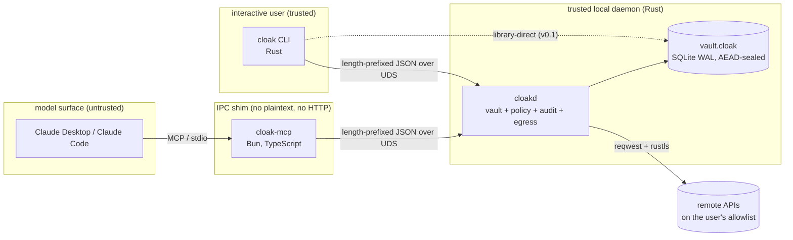

# Cloak architecture

> Companion to `README.md` and `docs/THREAT_MODEL.md`. This document
> describes how the three Cloak processes fit together, where the trust
> boundary sits, and how a request flows from a Claude tool call to a
> decrypted-then-discarded secret on the wire.

## Three processes, one trust boundary



The trust boundary is the UDS at `${XDG_RUNTIME_DIR:-${TMPDIR:-/tmp}}/cloakd-$UID.sock`.
Everything to the left of it is treated as untrusted: the MCP shim has zero
authority of its own; it is a typed wire-format adapter. Everything to the
right of it owns the master key, the policy file, the audit log, and all
outbound HTTP.

There are exactly four parties in the system. They communicate by exactly
two protocols.

| Party | Implementation | Trust class | Speaks |
|---|---|---|---|
| Claude Desktop / Claude Code | external | **untrusted** (model output) | MCP |
| `cloak-mcp` shim | Bun, TS, single binary | **policy-bridge** (no secrets, no HTTP) | MCP ↔ Cloak IPC |
| `cloakd` daemon | Rust, Tokio, libsodium | **trusted** (owns the vault) | Cloak IPC, outbound HTTPS |
| `cloak` CLI | Rust, clap | **trusted** (user-driven) | Cloak IPC, library-direct vault for `init`/`add`/`set`/`rm`/`show` in v0.1 |

The CLI is dual-mode in v0.1: it speaks the same IPC for `daemon-unlock` and
status-style queries, but for vault-mutating operations it opens the
SQLite file directly. v1.x absorbs the rest of the CLI onto IPC.

## The IPC contract

Frozen and documented separately at `docs/IPC_WIRE.md`. The TL;DR:

- Length-prefixed JSON, 4 MiB cap, both directions.
- Symbolic, lowercase-kebab error codes (`peer-not-trusted`, `vault-locked`,
  `policy-denied`, `aead-failure`, `audit-broken`, …).
- Methods are dotted (`mcp.handshake`, `vault.list`, `tool.sign_request`).
- Every method except `*.handshake` carries a `session_token` bound to
  `(peer_pid, peer_basename, conn_id, expires_at)`.

The Rust side of the framing lives in `crates/cloak-core/src/ipc.rs`. The
TypeScript side lives in `packages/cloak-mcp/src/ipc.ts`. Both implementations
agree on `MAX_FRAME_SIZE = 4 * 1024 * 1024`. The `Error → RpcError` mapping
is at `crates/cloak-core/src/ipc.rs:104-150`.

### Peer authentication

Before the daemon issues any session token, it resolves the peer's
credentials from the kernel and gates them through `peer_auth::check()`.

- **macOS** (`crates/cloak-core/src/peer_auth.rs:127-140`): `getsockopt(SOL_LOCAL,
  LOCAL_PEERPID)` for the PID, `getpeereid(2)` for UID/GID, `proc_pidpath(3)`
  for the binary path. The on-disk binary is SHA-256-hashed as a v0.1 surrogate
  for a real mach-o code-directory hash; the basename is the v0.1 gate.
- **Linux** (`crates/cloak-core/src/peer_auth.rs:142-154`): `SO_PEERCRED` for
  PID/UID/GID, `/proc/<pid>/exe` for the binary path. Same SHA-256 surrogate.
- **The default allowlist** (`crates/cloak-core/src/peer_auth.rs:50-63`) is
  `cloak`, `cloak-mcp`, `cloakd`. Same UID is required.

The accept-loop wires this to dispatch at
`crates/cloak-core/src/daemon.rs:235-292`: peer-auth runs, the connection
either gets a `conn_id` and proceeds to the request loop or is closed
without a write.

### Session lifecycle

`crates/cloak-core/src/session.rs` issues a 32-byte random token,
base64url-encoded, on the first `*.handshake`. Tokens carry a 30-minute TTL
(`session::default_ttl()`), are bound to the connection's `conn_id`, and are
compared with `subtle::ConstantTimeEq::ct_eq`
(`crates/cloak-core/src/session.rs:124`). When the connection closes, every
session token bound to that `conn_id` is revoked
(`crates/cloak-core/src/daemon.rs:289-291`).

## Storage layout

A single SQLite database at `~/Library/Application Support/cloak/vault.cloak`
on macOS (XDG-equivalent on Linux). WAL journal mode, `synchronous = NORMAL`,
all tables `STRICT`. Migrations are forward-only and recorded in
`schema_migrations` (`crates/cloak-core/src/store.rs:20-21`,
`crates/cloak-core/migrations/0001_init.sql`).

```
+----------------------+        +------------------------------+
|  meta (id = 1)       |        |  secrets                     |
+----------------------+        +------------------------------+
|  format_version      |        |  id            (rowid)       |
|  salt (16 B)         |        |  name          (UNIQUE)      |
|  kdf_phc (PHC str)   |        |  kind                        |
|  wrap_nonce (24 B)   |        |  tags          (JSON array)  |
|  wrap_aead           |        |  created_at                  |
|  monotonic_counter   |        |  updated_at                  |
|  created_at          |        |  version       (monotonic)   |
+----------------------+        |  nonce         (24 B)        |
                                |  ciphertext    (ct || tag)   |
                                +------------------------------+
```

### Master key wrap

The vault master key is generated once at `init`, stays in `cloakd` memory
while the vault is unlocked, and is **never** persisted in plaintext.

1. **Pepper** comes from the OS keychain — macOS Keychain (system-keychain
   item ACL-restricted to `cloakd`) or freedesktop Secret Service / GNOME
   Keyring on Linux. `CLOAK_PEPPER_FILE` is a 0600-only escape hatch for CI
   and headless servers (`crates/cloak-core/src/keychain.rs`).
2. **`wrap_key = Argon2id(HMAC-SHA256(pepper, passphrase), salt, params)`**
   — keyed-mode KDF, autotuned to ≤500 ms at `init`. The pepper raises the
   bar for an offline attacker who has only the vault file.
   (`crates/cloak-core/src/crypto.rs:366-381`)
3. **`wrap_aead = XChaCha20-Poly1305-IETF(wrap_key, wrap_nonce, master, AAD = b"cloak.master.v1")`**
   — versioned AAD so a future v2 wrap scheme will not collide with v1.
   (`crates/cloak-core/src/vault.rs:40,210,246`)

### Per-record subkeys and AAD

Each `secrets` row carries its own AEAD nonce and ciphertext. The per-record
key is **not** the master key — it is derived per-rowid:

```
record_key = crypto_kdf_derive_from_key(master, record_id, b"cloakrec")
```

(`crates/cloak-core/src/crypto.rs:533-542`,
`crates/cloak-core/src/vault.rs:42-43`)

The AAD bound to each record's ciphertext is built canonically as

```
name_len_be(u32) || name_utf8 || created_unix_be(i64) || version_be(u64)
```

(`crates/cloak-core/src/vault.rs:414-426`). This binds the record's identity
to the ciphertext, so a row's ciphertext cannot be swapped under another
row's name (verified by
`vault::tests::aad_swap_attack_fails`).

### Rollback resistance

The `meta.monotonic_counter` lives in the vault file *and* is mirrored
into a separate OS-keychain item (`dev.cloak` / `vault.rollback-counter.v1`,
8 bytes big-endian). Every write enforces strict increase via
`bump_counter` and best-effort updates the mirror, so a thief who
restores `vault.cloak` from a stale backup hits `Error::VaultRollbackDetected`
*on open*, before any record is decrypted — read-side rollback is
detected on every `Vault::open_or_create`. The check follows three
rules: file == mirror is a no-op; file > mirror is a legitimate
forward bump (e.g. an rsync from a paired device) that refreshes the
mirror; file < mirror is rejected. A missing mirror (fresh install or
upgrade from a Cloak that didn't have the mirror) is seeded from the
file on first open. With `CLOAK_PEPPER_FILE` set the mirror falls back
to a 0600 file alongside the pepper; in that fallback an attacker who
can roll back the vault can also roll back the counter file in
lockstep — see `docs/THREAT_MODEL.md`.

## Privileged tool dispatch

Every privileged tool handler in `crates/cloak-core/src/handlers.rs`
follows the same five-step recipe (`crates/cloak-core/src/handlers.rs:1-20`):

1. Parse + validate parameters (typed, no free-form JSON).
2. Resolve the policy `EvalContext` from `(tool, secret_name, secret_kind,
   target_host, peer_basename)`.
3. Run the policy gate. On `Action::Deny` or `RequireConfirmation`,
   audit a `Denied` entry and return `Error::PolicyDenied` — **never**
   touching the vault.
4. Run the rate-limit gate (token bucket per `(tool, peer, secret)`).
   On exhaustion, audit `Denied` and return `Error::PolicyDenied("rate limited")`.
5. Only now read the secret from the unlocked vault, perform the operation,
   audit `Ok` (or `Error` on a downstream failure), and return.

The order is load-bearing: a denied call cannot decrypt
(`crates/cloak-core/src/handlers.rs:109-185`).

## Outbound HTTP

`crates/cloak-core/src/egress.rs` is the **only** outbound HTTP module in
the workspace. It uses `reqwest` with the rustls TLS provider, the system
root store, a 3-redirect cap, and a 30-second total timeout. The MCP shim
imports zero HTTP clients — `packages/cloak-mcp/scripts/check-no-http.mjs`
(invoked by `bun run lint:no-http`) fails CI on regression.

`tool.proxy_http` enforces `policy.toml::allowed_hosts` before issuing the
request. The auth header is attached by the daemon and is **stripped** from
the echoed response metadata (`crates/cloak-core/src/handlers.rs`).

## Audit log

Append-only JSONL at `<data_dir>/cloak/audit.jsonl`. Every privileged tool
call writes exactly one entry — `Ok`, `Denied`, or `Error`. The chain hash
is `SHA-256` over the RFC 8785 canonical-JSON serialization of the previous
entry; `prev_hash[0]` is `"0".repeat(64)`
(`crates/cloak-core/src/audit.rs:1-186`).

`cloak audit verify` recomputes the chain from disk and rejects any mutated,
deleted, or reordered line (`crates/cloak-core/src/audit.rs:188-220`).
Concurrent appends are gated by an `fs2` exclusive `flock` and an `fsync`
on every write
(`crates/cloak-core/src/audit.rs::tests::concurrent_appends_are_atomic_and_complete`).

## Repository map

```
crates/cloak-core/
├── src/
│   ├── crypto.rs       libsodium FFI; Secret<T>; AEAD; Argon2id; subkey KDF
│   ├── vault.rs        Vault open/unlock/add/set/show; AAD construction
│   ├── store.rs        SQLite WAL + STRICT tables + migrations
│   ├── keychain.rs     macOS Keychain / Linux Secret Service / pepper file
│   ├── ipc.rs          length-prefixed JSON framing; Error → RpcError
│   ├── peer_auth.rs    SOL_LOCAL/LOCAL_PEERPID, SO_PEERCRED, basename allowlist
│   ├── session.rs      tokens; ConstantTimeEq compare; revoke_by_conn
│   ├── daemon.rs       accept loop; dispatcher; CLI-only gate
│   ├── handlers.rs     privileged tool handlers (sign, proxy, mint, audit)
│   ├── policy.rs       TOML DSL; rate-limit buckets; EvalContext
│   ├── audit.rs        hash-chained JSONL; verify()
│   ├── egress.rs       reqwest + rustls; allowlist enforcement
│   └── error.rs        typed errors (mapped to RpcError on the wire)
├── migrations/0001_init.sql
└── tests/              ipc_e2e.rs, handlers_e2e.rs

crates/cloak-cli/
└── src/commands/       init, add, set, get, list, rm, show, status,
                        completions, daemon-unlock, unlock

packages/cloak-mcp/
└── src/
    ├── server.ts       MCP transport; the only entry point
    ├── ipc.ts          length-prefixed JSON client
    └── tools/          one file per tool (zod schema + dispatch)
```

## Cross-references

- Wire contract: `docs/IPC_WIRE.md`
- Threat model: `docs/THREAT_MODEL.md`
- Tool spec (JSON Schema, descriptions, examples): `docs/spec/mcp-tools.md`
- Security invariants (file:line, test, CI gate): `docs/SECURITY_INVARIANTS.md`
- Release verification (cosign + slsa-verifier): `docs/RELEASE.md`
